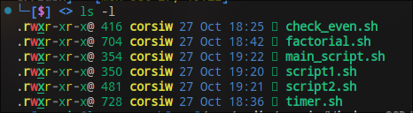
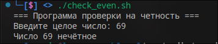
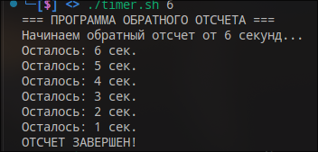
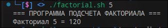
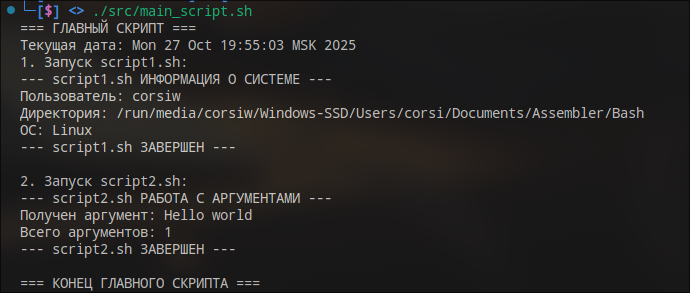

# Отчет по скриптам на Bash. Homeword#6

## Введение

Данный отчет описывает 4 программы на языке Bash, реализующие различные функциональности с использованием основных конструкций языка: условных операторов, циклов, функций и вызова скриптов из других файлов.

Всем файлам дано разрешение на выполение для всех пользователей

## Скрипт check_even.sh

### Назначение
Программа проверяет четность числа, введенного пользователем.

[check_even.sh](src/check_even.sh)

### Особенности
- **Валидация ввода** - проверка, что введено целое число
- **Использование if** - условный оператор для проверки четности

### Результат работы

## Скрипт timer.sh

### Назначение
Программа реализует таймер обратного отсчета с указанием времени в секундах.

[timer.sh](src/timer.sh)

### Особенности
- **Цикл while** - основной цикл обратного отсчета
- **Проверка аргументов** - обработка входных параметров
- **Функция sleep** - использование задержки на 1 секунду

### Результат работы

## Скрипт factorial.sh

### Назначение
Программа вычисляет факториал числа с использованием рекурсивной функции.

[factorial.sh](src/factorial.sh)

### Особенности
- **Рекурсивная функция** - функция вызывает саму себя
- **Локальные переменные** - использование `local` для изоляции переменных
- **Обработка граничных условий** - проверка на неотрицательность входного параметра и соответствие целому числу.
- **Переполнение** - для достаточно больших входных параметрах можем получить отрицательное число из-за переполнения.

### Результат работы

## Скрипты main_script.sh, script1.sh, script2.sh

### Назначение
Демонстрация вызова скриптов из других файлов.

### Код программ

[main_script.sh](src/main_script.sh),
[script1.sh](src/script1.sh),
[script2.sh](src/script2.sh).

### Особенности
- **Вызов внешних скриптов** - использование `./имя_скрипта.sh`
- **Передача аргументов** - вызов скриптов с параметрами
- **Расположение скриптов** - ожидается, что все 3 скрипта в одной папке, причем не важно из какой директории производится вызов main_script.sh

### Результат работы

---